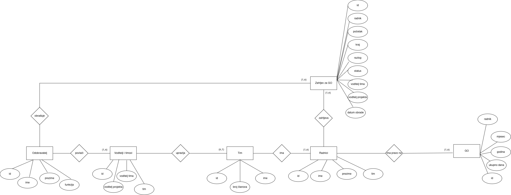

# Week 2

## ERA Schema

<br>


<br>

The schema has entities: Worker, Annual Leave, Team, Approver (as Team Leader or Project Leader), Leader Team and Request for Annual Leave. <br>

**Schema :** /src/schema/

## Wireframe

.jpg)

<br>

**Wireframe :** /src/schema/

## Symfony

### Setup

<br>

I already have a project so i will be configuring Symfony on already existing project. <br>

Downloading Symfony CLI:
<br>

```bash
    wget https://get.symfony.com/cli/installer -O - | bash
```
<br>

since i use Linux i had to add the Symfony CLI binary path to the shell configuration file:

<br>

```bash
    #open configuration file in text editor
    nano ~/.bashrc

    #add this line at the end of the file: export PATH="$HOME/.symfony5/bin:$PATH"

    #reload configuration
    source ~/.bashrc

    #check version and confirm the installation was successful
    symfony -v
```

### Running Symfony Applications

To run the application i had to position to my current directory and run command: <br>

```bash
    symfony server:start
```

### Installing Packages

For automated setup for managing Symfony projects and their dependencies more efficiently i used Symfony Flex. <br>

Installation: <br>

```bash
    composer require symfony/flex
```

## Http Kernel

Installation: <br>

```bash
    composer require symfony/http-kernel
```