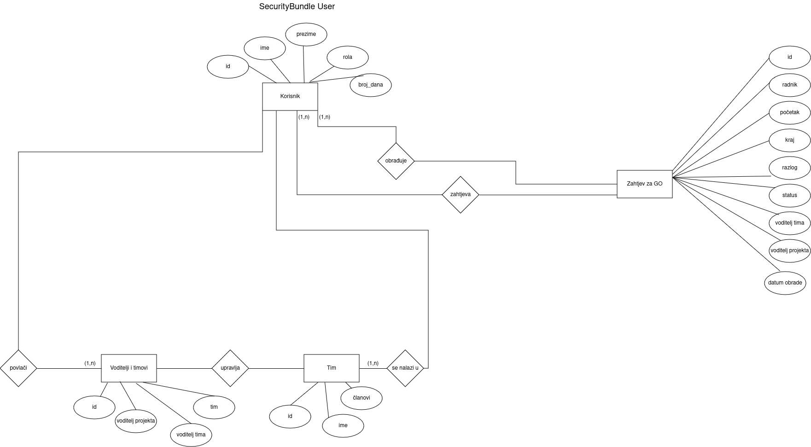

# Week 2

## ERA Schema

<br>


<br>

The schema has entities: Worker, Annual Leave, Team, Approver (as Team Leader or Project Leader), Leader Team and Request for Annual Leave. <br>

**Schema :** /src/schema/

## Wireframe

.jpg) 

<br>

**Wireframe :** /src/schema/

## Symfony

### Setup

<br>

Downloading Symfony CLI:
<br>

```bash
    wget https://get.symfony.com/cli/installer -O - | bash
```
<br>

since i use Linux i had to add the Symfony CLI binary path to the shell configuration file:

<br>

```bash
    #open configuration file in text editor
    nano ~/.bashrc

    #add this line at the end of the file: export PATH="$HOME/.symfony5/bin:$PATH"

    #reload configuration
    source ~/.bashrc

    #check version and confirm the installation was successful
    symfony -v
```

<br>

Creating a Symfony 7.1 project:

```bash
   symfony new . --version="7.1.*" --webapp
```

### Running Symfony Applications

To run the application i had to position to my current directory and run command: <br>

```bash
    symfony server:start
```

### Installing Packages

For automated setup for managing Symfony projects and their dependencies more efficiently i used Symfony Flex. <br>

Installation: <br>

```bash
    composer require symfony/flex
```

### Http Kernel

Installation: <br>

```bash
    composer require symfony/http-kernel
```

### Doctrine

Installation <br>

```bash
    composer require symfony/orm-pack
```
<br>

Entity creation: <br>

```bash
    php bin/console make:entity
```

Relations creation: <br>

```bash
    php bin/console make:entity

    # in the console select created entity eg. AnnualLeave

    #as property name write the table's name we want a relationship with

    #field type: relation

    #at the end write the table you want a relation with as well as relation type

    ## Do you want to add a new property to Worker so that you can access/update AnnualLeave objects from it - e.g. $worker->getAnnualLeaves()? (yes/no) - yes    
```

Migrations creation <br>

```bash
    php bin/console make:migration

    # To execute migration

    php bin/console doctrine:migrations:migrate
```

### The UID Component

Installation: <br>

```bash
   composer require symfony/uid
```

### Fixtures

Installation: <br>

```bash
   composer require --dev orm-fixtures
```

Creation of new fixture: <br>

```bash
    php bin/console make:fixture
```

<br>

Load fixture into database:
<br>

```bash
    php bin/console doctrine:fixtures:load
```

### Unit Testing - PHPUnit

Used for testing services functionality.

Installation: <br>

```bash
    composer require --dev phpunit/phpunit

    #for running tests:

    php bin/phpunit
```

### SecurityBundle

Installation: <br>

```bash
    composer require symfony/security-bundle
```

## Project Details

**Entity dir :** src/Entity <br>
**Repositories dir :** src/Repository <br>
**Migrations dir :** src/migrations <br>
**Unit Tests dir :** tests/Unit <br>